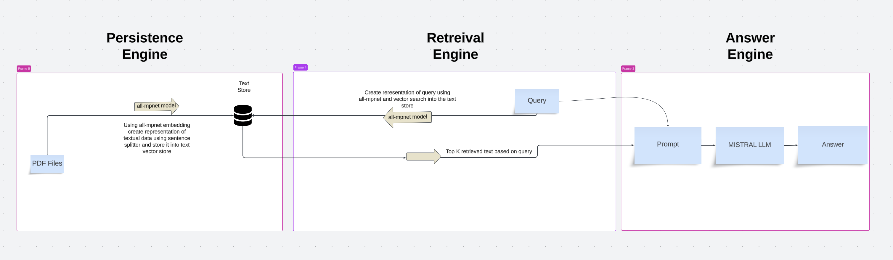
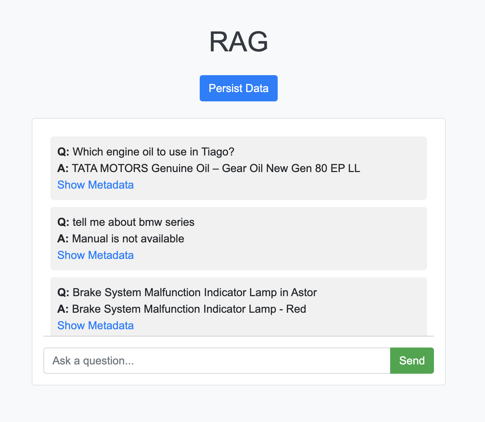

# MultiModal-RAG

## Table of Contents

1. [Introduction](#introduction)
2. [Architecture](#architecture)
3. [Modules](#modules)
    - [LlamaHandler](#llamahandler)
4. [Installation](#installation)
5. [Usage](#usage)
6. [Running the Application](#running-the-application)

## Introduction

This project is designed to extract and process data from PDF files. The processed data is stored in vector databases, allowing for efficient retrieval and question-answering using large language models (LLMs).

## Architecture

The architecture of the project consists of three main engines:

### Persistence Engine

1. **PDF Files**: The process starts with the input PDF files.
2. **all-mpnet Model**: Text data is embedded using the all-mpnet model, creating a representation of the textual data.
3. **Text Store & Image Store**: The embeddings are stored in respective vector databases for text.

### Retrieval Engine

1. **Query**: The user provides a query.
2. **all-mpnet Model**: The query is embedded using the all-mpnet model.
3. **Vector Search (Text)**: A search is conducted in the text store to retrieve the top K relevant text embeddings.

### Answer Engine

1. **Prompt Formation**: The retrieved text informations are combined to form a prompt.
2. **Mistral LLM**: The prompt is processed using the Mistal LLM to generate an answer.
3. **Answer**: The final answer is returned to the user.



## Project Structure
```
├── app.py
├── data
│   ├── index
│   ├── pdf
│   ├── readme_images
├── src
│   ├── config
│   │   ├── config.py
│   ├── llama_handler
│   │   ├── llama_handler.py
│   ├── prompts
│   │   ├── prompts.py
├── static
│   ├── styles.css
├── templates
│   ├── index.html
├── requirements.txt
├── README.md
```

## Modules

### LlamaHandler

The `LlamaHandler` class handles the embedding and retrieval of data, as well as generating answers using LLMs. It performs the following tasks:
- Embeds text using pre-trained models.
- Stores embeddings in vector databases.
- Retrieves relevant data based on a query.
- Generates context for the answer engine.
- Uses Mistal LLM to provide answers.

## Installation

### Dependencies 

To install the necessary dependencies, run:

```bash
pip install -r requirements.txt
```

### Ollama Setup 

Download Ollama from here [Ollama](https://ollama.com/)

Run the following code after installing Ollama 

```bash
ollama run mistral
```


## Usage

### Running the Application

To start the Flask application, run:

```bash
python app.py
```

Navigate to http://localhost:5000 in your web browser to access the application.

### Processing PDFs

Add Pdf files at this location ./data/pdf

To process the PDFs and persist the data, send a POST request to the `/persist` endpoint:

```bash
curl -X POST http://localhost:5000/persist
```

### Asking Questions

To ask a question and receive an answer, send a POST request to the /answer endpoint with the question in the request body

```bash
curl -X POST -H "Content-Type: application/json" -d '{"question": "Your question here"}' http://localhost:5000/answer
```

### UI 

This how the interactive UI looks


